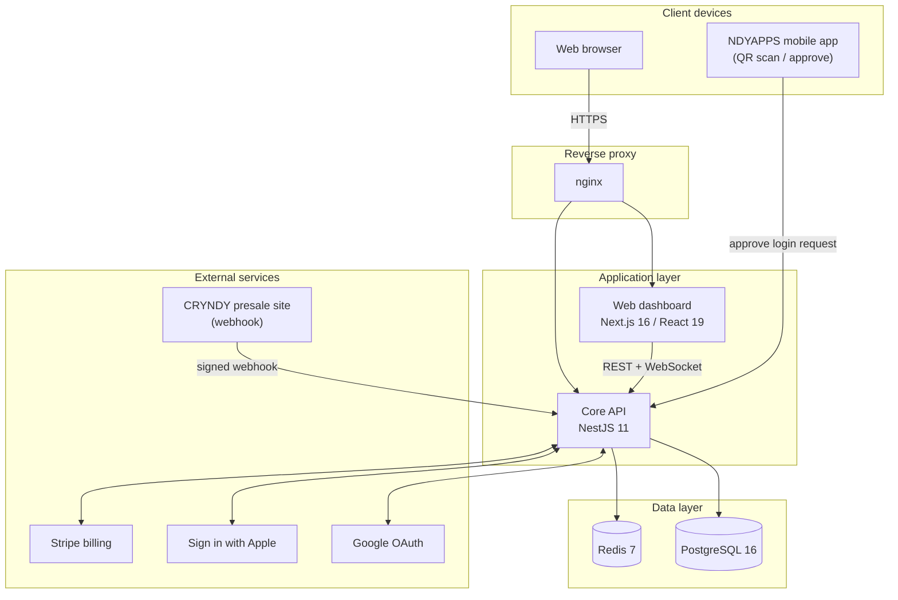
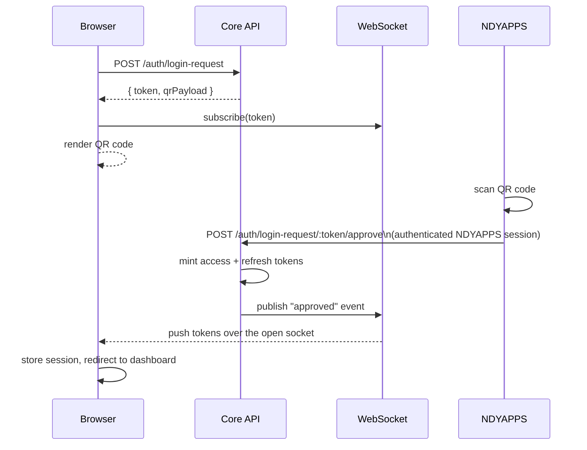
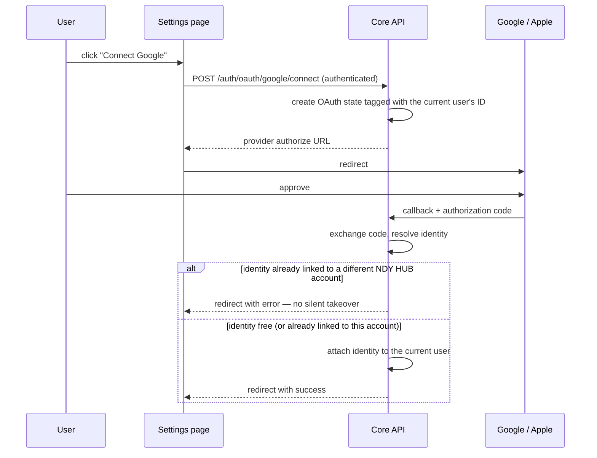
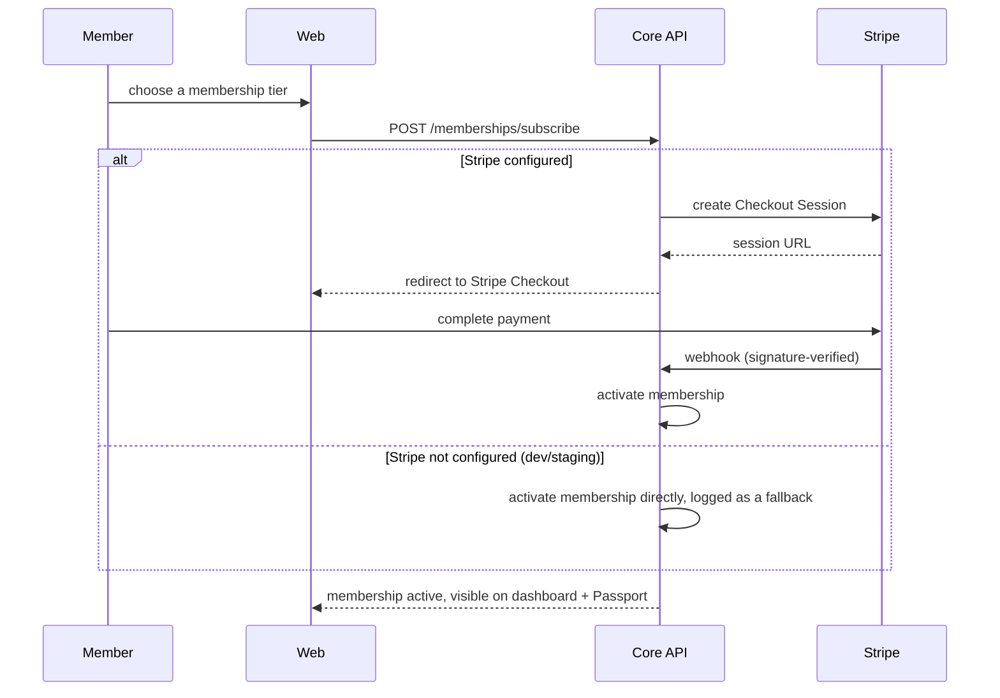
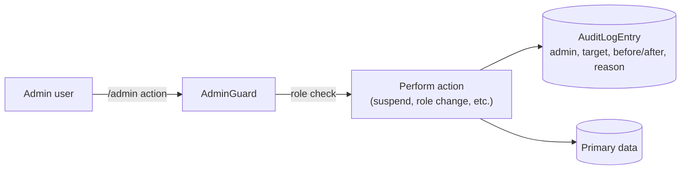
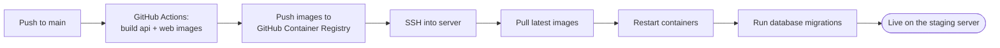

# NDY HUB

**One Identity. One Passport. One Ecosystem.**

NDY HUB is the identity and membership core of the NDY ecosystem — a single
account (the **NDY Passport**) that a member uses to sign into every NDY
product, manage their membership tier, track CRYNDY and NDYBITS holdings,
and control exactly which platforms and devices are connected to their
identity.

[](https://github.com/sufyanmughal/NDY-HUB/actions/workflows/deploy-staging.yml)

---

## Table of contents

- [System architecture](#system-architecture)
- [Core workflows](#core-workflows)
  - [QR / deep-link login](#1-qr--deep-link-login)
  - [Connected accounts (Google/Apple linking)](#2-connected-accounts-googleapple-linking)
  - [Membership subscription](#3-membership-subscription)
  - [Admin moderation & audit trail](#4-admin-moderation--audit-trail)
- [Deployment pipeline](#deployment-pipeline)
- [Feature matrix](#feature-matrix)
- [Tech stack](#tech-stack)
- [Project layout](#project-layout)
- [Running it locally](#running-it-locally)
- [Roadmap](#roadmap)

---

## System architecture



Everything a member does — register, log in, manage 2FA/passkeys, link a
Google or Apple account, subscribe to a membership tier, track CRYNDY/NDYBITS,
open a support ticket — goes through the one Core API. It is the single
source of truth for identity data; nothing else in the ecosystem writes to it
directly.

## Core workflows

### 1. QR / deep-link login

The flagship flow: a member scans a QR code on `/login` with the NDYAPPS
mobile app, approves it there, and the browser tab logs in live — no polling,
no page refresh.



The login request is single-use and expires after 90 seconds. Approval
requires an already-authenticated NDYAPPS session — there is no path that
lets an unauthenticated device approve a login for someone else.

### 2. Connected accounts (Google/Apple linking)

Linking a social identity to an *already signed-in* account is a distinct
flow from using that same provider to log in — the two are never allowed to
collide silently.



Unlinking is guarded the same way in reverse: the API refuses to remove the
last remaining sign-in method (no password, no other linked identity, no
passkey) so a member can never accidentally lock themselves out of their own
account.

### 3. Membership subscription



### 4. Admin moderation & audit trail

Every privileged action — role changes, suspensions, OAuth client changes,
support replies — writes an immutable entry to the shared audit log with
before/after values, so there is always a record of who changed what and why.



## Deployment pipeline

Every push to `main` ships automatically — no manual server work required to
get a change in front of the client.



The server only ever pulls and runs pre-built images — it never compiles
anything itself, which keeps deploys fast and the server's resource
requirements small.

### Environments

| Environment | Trigger | Status |
|---|---|---|
| Development | Local machine | Always available to the dev team |
| Staging | Push to `main` | Live — this is what the client reviews |
| Production | Manual promotion once ready to go live | Not provisioned yet — the pipeline (`deploy-reusable.yml`) is already built to support it: a second GitHub Environment with its own server and secrets is all that's needed, no rebuild |

No untested change reaches a real user: `main` only ever deploys to
Staging automatically. Promoting to Production will always be a deliberate,
separate action once that environment exists.

### Reliability & operations

- **Monitoring**: server-level metrics (CPU, memory, disk, bandwidth) are
  monitored with alert thresholds, so infrastructure problems surface
  before they become outages.
- **Backups**: the database is backed up automatically every night, with a
  documented, tested restore procedure — see `deploy/README.md` for the
  full disaster-recovery process.
- **Immutable audit trail**: every admin action and every CRYNDY/NDYBITS
  transaction is append-only and permanently recorded — nothing gets
  silently edited or deleted.

## Feature matrix

| Area | Status | Notes |
|---|---|---|
| Registration, login, profile | ✅ Live | NDY ID generation is collision-safe and excludes visually ambiguous characters |
| QR / deep-link login | ✅ Live | Real-time over WebSocket, 90-second single-use requests |
| Two-factor authentication | ✅ Live | TOTP + backup codes |
| Passkeys (WebAuthn) | ✅ Live | Passwordless sign-in |
| Google / Apple sign-in | ✅ Live | Includes account linking distinct from login |
| Session & device management | ✅ Live | Per-session revoke, revoke-all |
| Membership tiers & billing | ✅ Live | Stripe Checkout when configured, dev fallback otherwise |
| CRYNDY & NDYBITS | ✅ Live | Full purchase lifecycle, signed webhook intake, append-only ledger |
| Transactions history | ✅ Live | Unified across memberships and CRYNDY |
| Documents | ✅ Live | Generated on demand from live data |
| Admin console | ✅ Live | User management, audit log, OAuth client management |
| Support tickets | ✅ Live | Member submission + admin reply |
| Mobile navigation | ✅ Live | Responsive drawer navigation |
| Connected Platforms | 🔜 Planned | UI in place, backend not yet built |
| Object storage (S3/R2) | 🔜 Planned | Documents currently generated on demand rather than stored |

## Tech stack

| Layer | Technology |
|---|---|
| Frontend | Next.js 16 (App Router), React 19, Tailwind CSS v4 |
| Backend | NestJS 11, Prisma ORM |
| Database | PostgreSQL 16 |
| Cache / pub-sub | Redis 7 |
| Auth | JWT + rotating refresh tokens, TOTP 2FA, WebAuthn passkeys, OAuth 2.0 (Google, Apple), OIDC provider |
| Infrastructure | Docker, GitHub Actions CI/CD, nginx, DigitalOcean |

## Project layout

```
ndy-hub/
├── apps/
│   ├── api/    NestJS + TypeScript — the Core API, the only thing that writes identity data
│   └── web/    Next.js + TypeScript + Tailwind — the NDY HUB dashboard
├── deploy/     Server bootstrap script, nginx config, deployment docs
├── docker-compose.yml        Local Postgres + Redis (development)
├── docker-compose.prod.yml   Full production stack
└── package.json               npm workspaces root
```

## Running it locally

Requires Node 20+, npm, and Docker Desktop running (for Postgres/Redis).

```bash
# from the repo root
npm install
npm run db:up                 # starts Postgres + Redis
npm run --workspace apps/api exec -- prisma migrate dev --name init
npm run dev:api                # http://localhost:3000
npm run dev:web                # http://localhost:3001
```

`apps/api/.env` is already set up to match `docker-compose.yml` — no edits
needed for local dev. `.env.example` files (in both `apps/api` and
`apps/web`) document every variable if you're pointing at something else.

## Roadmap

1. Move sessions from `localStorage` to an httpOnly cookie set by the API —
   the intended production security posture.
2. Real object storage (S3/R2) for Documents once a bucket is provisioned.
3. A Connected Platforms backend — currently the last page on mock data.
4. Whatever the team decides on the crypto payment rail for the CRYNDY
   presale — a business decision, not an engineering one.
