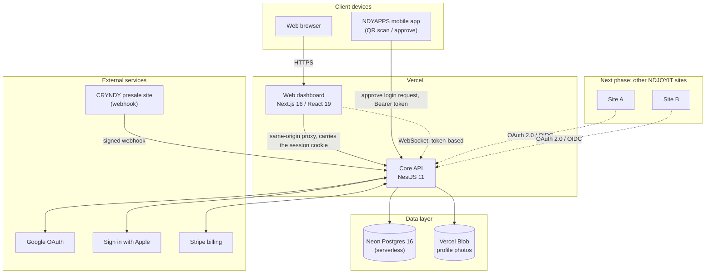
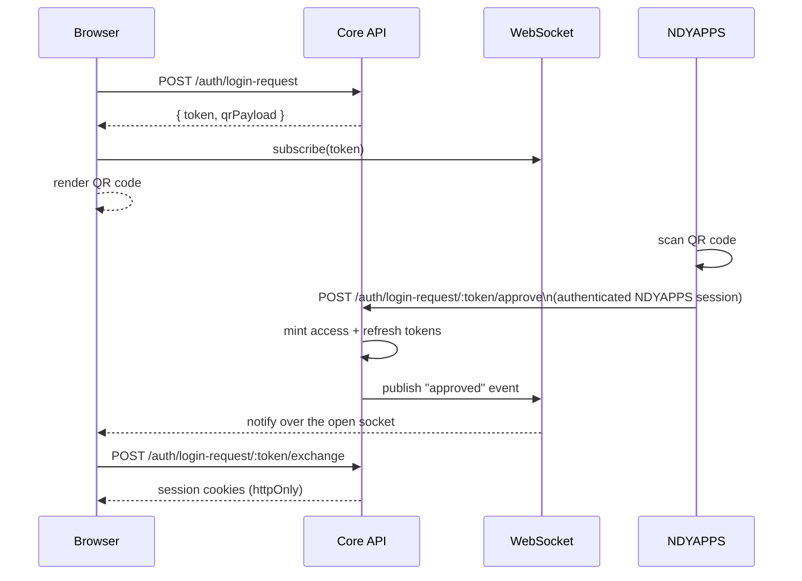
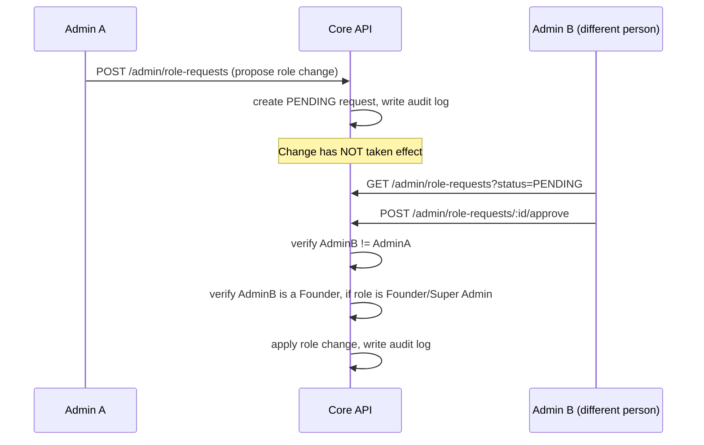

# NDY HUB

**One Identity. One Passport. One Ecosystem.**

NDY HUB is the identity and membership core of the NDY ecosystem — a single
account (the **NDY Passport**) a member uses to sign into every NDY product,
manage their membership tier, track CRYNDY and NDYBITS holdings, and control
exactly which platforms and devices are connected to their identity. It is
also an **OAuth 2.0 / OIDC identity provider** in its own right: any other
NDJOYIT site can register as a client and let members sign in with their
existing NDY Passport instead of standing up separate accounts.

**Live:** [ndy-hub-web.vercel.app](https://ndy-hub-web.vercel.app)

---

## Table of contents

- [System architecture](#system-architecture)
- [Design principles](#design-principles)
- [Identity & access model](#identity--access-model)
- [Core workflows](#core-workflows)
- [Security posture](#security-posture)
- [Tech stack](#tech-stack)
- [Deployment](#deployment)
- [Testing](#testing)
- [Project layout](#project-layout)
- [Running it locally](#running-it-locally)
- [Feature matrix](#feature-matrix)
- [Roadmap](#roadmap)

---

## System architecture



Everything a member does — register, log in, manage 2FA/passkeys, link a
Google or Apple account, subscribe to a membership tier, track CRYNDY/NDYBITS,
open a support ticket — goes through the one Core API. It is the single
source of truth for identity data; nothing else in the ecosystem writes to it
directly.

The frontend never calls the API directly from the browser. `apps/web`
proxies `/api/*` through its own origin (a Next.js rewrite) to the API's real
Vercel deployment, so the API's session cookie stays `SameSite=Lax` instead
of needing `SameSite=None` — the two apps live on different `vercel.app`
subdomains, which browsers treat as genuinely different sites, and
`SameSite=None` cookies are exactly what Safari/Firefox's cross-site tracking
protections are increasingly aggressive about dropping.

## Design principles

The decisions that shape everything else in this document:

- **One system of record.** The Core API is the only thing that ever writes
  identity data. The dashboard, NDYAPPS, and every connected NDJOYIT site
  read through it or act through it — never around it. There's no
  reconciliation problem to solve later because there's nowhere else data
  could have quietly diverged.
- **Fail closed.** A route wired to the permission guard with no permission
  declared throws rather than defaulting to open — a wiring mistake becomes
  an error, not a silent hole. The same instinct runs through the rest of
  the system: unlinking the last remaining sign-in method is refused
  outright, not left as a "please don't do this" comment; approving a login
  request requires an already-authenticated session with no fallback path.
- **No single point of trust for irreversible actions.** Granting elevated
  access is dual-approval by construction — the server itself rejects a
  requester's attempt to approve their own request. It isn't a policy
  someone has to remember to follow.
- **Authorization is re-verified, not cached.** A role check queries the
  database on every request instead of trusting a claim signed into an
  access token. A revoked admin stops being an admin the moment the change
  lands, not fifteen minutes later when their token happens to expire.
- **Every privileged action leaves a permanent, attributable record** — who,
  what, before/after, and why, written at the moment it happens, not
  reconstructed from logs afterward.
- **Security wins over convenience when the two conflict.** Sessions live in
  httpOnly cookies specifically because that closes an XSS exfiltration path
  a simpler `localStorage` implementation would leave open — even though it
  meant solving a same-site cookie problem across two separately deployed
  Vercel apps to do it properly, rather than reaching for a weaker cookie
  policy to make the problem disappear.
- **Tests target what actually breaks things, not a coverage percentage** —
  the permission matrix, the auth guards, the dual-approval edge cases, and
  the full cookie session lifecycle against a real database. Those are the
  surfaces where a subtle bug is a security incident, not a bug report.

## Identity & access model

A member's own account is always `USER`. Staff/operator roles are a separate
axis, assigned by a Founder or Super Admin and enforced end-to-end:

| Role | What it can do |
|---|---|
| **FOUNDER** | Everything — the only role that can grant `FOUNDER` or `SUPER_ADMIN` to someone else |
| **SUPER_ADMIN** | Manage users, manage roles (except Founder/Super Admin), manage OAuth clients, manage support tickets, view the audit log |
| **DEVELOPER** | Manage OAuth clients (registering/rotating the sites allowed to use NDY HUB as an identity provider) |
| **FINANCE** | Read-only visibility into revenue, CRYNDY sales, and NDYBITS issuance — nothing else |
| **SUPPORT** | Manage support tickets |
| **AUDITOR** | Read-only access to the audit log |
| **CONTENT**, **PARTNERS** | Reserved roles with no permissions wired yet — no content or partner-management feature exists to gate |

Permissions are checked against a `Role → Permission[]` map
(`apps/api/src/common/permissions.ts`) on every request — a guard re-queries
the caller's *current* role from the database rather than trusting a claim
baked into their access token, so a demoted admin's session stops working
immediately instead of lingering until the token naturally expires. The
frontend mirrors the same map to decide what to show (`lib/permissions.ts`),
but that's UX only; the API is the actual authority.

**Role changes are dual-approval**, not instant: one admin with
`MANAGE_ROLES` proposes a change, and a *different* admin has to approve it
before it takes effect. The requester can't approve their own request, and
assigning Founder or Super Admin requires the approver to themselves be a
Founder — both enforced server-side, not just hidden in the UI.

## Core workflows

### QR / deep-link login

A member scans a QR code on `/login` with the NDYAPPS mobile app, approves it
there, and the browser tab logs in live over a WebSocket — no polling, no
page refresh (with a polling fallback if the socket never connects).



The login request is single-use and expires after 90 seconds. Approval
requires an already-authenticated NDYAPPS session — there is no path that
lets an unauthenticated device approve a login for someone else.

### NDY Passport — the public digital identity card

Every account has a public, unauthenticated profile page at
`/passport/:ndyId` — the actual destination the QR code on a member's own
Passport page (and its downloadable PDF) encodes. It renders whatever the
owner has chosen to make public: name, photo, verification badge, bio,
country, website/social links, business info, member-since date, and a
Share button. Fields the owner has toggled private are never sent to the
client at all — the `*IsPublic` flags on `User` are enforced in the API
response itself, not hidden client-side. A signed-out visitor sees a "Claim
your own" call to action; a signed-in visitor sees a link back to their own
dashboard instead.

New accounts are prompted once, immediately after signup, to fill this in
at `/passport/complete` — only full name is required (the rest is
skippable, and editable any time from Settings). In practice this screen
only appears for OAuth/passkey signups, since password registration's own
form already collects a name.

### Connected accounts (Google/Apple linking)

Linking a social identity to an *already signed-in* account is a distinct
flow from using that same provider to log in — the two are never allowed to
collide silently. If the provider identity is already linked to a different
NDY HUB account, the link attempt is rejected rather than silently taking
over. Unlinking is guarded the same way in reverse: the API refuses to remove
the last remaining sign-in method (no password, no other linked identity, no
passkey) so a member can never accidentally lock themselves out.

### Membership subscription

Stripe Checkout when configured; in dev/staging without Stripe credentials,
the membership activates directly so the rest of the flow can still be
tested end to end.

### Dual-approval role changes



### Admin moderation & audit trail

Every privileged action — role changes, suspensions, OAuth client changes,
support replies — writes an immutable entry to the shared audit log with
before/after values and the acting admin's identity, so there is always a
record of who changed what and why.

## Security posture

- **httpOnly session cookies** — access and refresh tokens never touch
  `localStorage` or any script-readable storage; an XSS bug can't exfiltrate
  a session. Cookies are `Secure`, `SameSite=Lax`, and rotated on every
  refresh (the old refresh token is revoked the instant a new one is issued,
  so a stolen-and-reused token only works once).
- **Non-browser clients** (NDYAPPS, future API integrations) authenticate
  with a Bearer token instead — there's no cookie jar to rely on there. The
  guard accepts either.
- **RBAC re-checked server-side on every request**, not cached in the token
  (see [Identity & access model](#identity--access-model)).
- **Dual-approval on role changes** — no single admin can grant themselves
  or anyone else elevated access unilaterally.
- **2FA (TOTP + backup codes) and WebAuthn passkeys**, independent of
  password auth.
- **Rate limiting** on every credential-guessing surface (login, register,
  password reset, 2FA verify) tighter than the app-wide default.
- **CORS is an explicit allowlist** of known frontend origins, not a
  wildcard.
- **Uploaded photos go to Vercel Blob**, not local disk — a serverless
  function's local filesystem is ephemeral and per-instance, so anything
  written there can vanish before a later request tries to read it back.

## Tech stack

| Layer | Technology |
|---|---|
| Frontend | Next.js 16 (App Router, Turbopack), React 19, Tailwind CSS v4 |
| Backend | NestJS 11, Prisma ORM 6 |
| Database | PostgreSQL 16 (Neon, serverless) |
| File storage | Vercel Blob (profile photos) |
| Auth | httpOnly-cookie sessions with rotating refresh tokens, TOTP 2FA, WebAuthn passkeys, OAuth 2.0 (Google, Apple), and NDY HUB itself as an OIDC provider for other sites |
| Hosting | Vercel (both apps, independently deployed) |
| Testing | Jest (unit) + Supertest (e2e, against a real Postgres) |

Docker Compose is still available for local Postgres and for a self-hosted
deployment path (`docker-compose.prod.yml`, nginx, GitHub Actions in
`.github/workflows/`) — it's how this project deployed before moving to
Vercel, and remains a documented option, but isn't the current live path.

## Deployment

Both apps deploy independently to Vercel, straight from this repo:

- **`apps/web`** — the dashboard. Proxies `/api/*` to the API (see
  [System architecture](#system-architecture)); this is also where
  `NEXT_PUBLIC_API_URL` and the rewrite destination point.
- **`apps/api`** — the NestJS API, deployed as a Vercel Node.js backend
  (auto-detected from `package.json`; no `vercel.json` build config needed).
  Requires `DATABASE_URL`/`DIRECT_URL` (Neon), `JWT_ACCESS_SECRET`,
  `JWT_REFRESH_SECRET`, `TOTP_ENCRYPTION_KEY`, `WEB_APP_URL`, `API_URL`,
  `BLOB_READ_WRITE_TOKEN` (Vercel Blob), plus `STRIPE_*`/`GOOGLE_*`/`APPLE_*`
  once those integrations are turned on.

Database migrations are hand-written SQL under
`apps/api/prisma/migrations/`, applied with `prisma migrate deploy`.

Both apps currently live on their default Vercel `*.vercel.app` domains —
there is no dedicated subdomain (e.g. a future `passport.ndyhub.com` for
public passport URLs) configured yet. That's a DNS/domain decision for
whoever owns the `ndyhub.com` registration, not something this repo can
set up on its own.

### Connecting another site as an OAuth client

This is the mechanism the next phase relies on. Any NDJOYIT site can let
members sign in with their NDY Passport instead of a separate account:

1. A Developer, Super Admin, or Founder registers the site under **Admin →
   Connected Websites**, providing its redirect URI(s) and the scopes it
   needs. This returns a `client_id`/`client_secret` pair (the secret is
   shown once).
2. The site implements a standard OAuth 2.0 Authorization Code flow (PKCE
   supported) against NDY HUB's endpoints, discoverable at
   `/.well-known/openid-configuration`.
3. NDY HUB shows the member a consent screen the first time (subsequent
   logins are silent if the same scopes were already granted — one login,
   not one consent screen per visit).
4. The site receives a signed ID token plus an access token scoped to what
   it asked for and was granted.

A member can review and revoke any site's access at any time from the
**Security** page.

## Testing

```bash
npm run --workspace apps/api test        # unit tests — no database needed
npm run --workspace apps/api test:e2e    # e2e — needs a real Postgres (DATABASE_URL)
```

Unit tests cover the security-critical logic in isolation with mocked
dependencies: the permission matrix, the crypto/base32 primitives behind 2FA,
the auth guards, and the dual-approval role-change logic (self-approval
rejection, Founder-only gating, already-resolved conflicts). E2E tests run
real HTTP requests against a real database, covering the full cookie-based
session lifecycle: register/login/refresh/logout, refresh-token rotation and
single-use enforcement, and cookie-only authentication with no Authorization
header.

## Project layout

```
ndy-hub/
├── apps/
│   ├── api/    NestJS + TypeScript — the Core API, the only thing that writes identity data
│   └── web/    Next.js + TypeScript + Tailwind — the NDY HUB dashboard
├── deploy/     Server bootstrap script, nginx config — the self-hosted deployment path
├── docker-compose.yml        Local Postgres (development)
├── docker-compose.prod.yml   Full self-hosted stack (alternative to Vercel)
└── package.json               npm workspaces root
```

## Running it locally

Requires Node 20+, npm, and Docker Desktop running (for Postgres).

```bash
# from the repo root
npm install
npm run db:up                 # starts Postgres
npm run --workspace apps/api exec -- prisma migrate dev --name init
npm run dev:api                # http://localhost:3000
npm run dev:web                # http://localhost:3001
```

`apps/api/.env` is already set up to match `docker-compose.yml` — no edits
needed for local dev. `.env.example` files (in both `apps/api` and
`apps/web`) document every variable if you're pointing at something else.

## Feature matrix

| Area | Status | Notes |
|---|---|---|
| Registration, login, profile | ✅ Live | NDY ID generation is collision-safe and excludes visually ambiguous characters |
| httpOnly-cookie sessions | ✅ Live | Rotating refresh tokens, reactive refresh-and-retry on the frontend |
| NDY Passport digital card | ✅ Live | Public, unauthenticated card at `/passport/:ndyId` (photo, name, verification badge, bio, country, website/social links, business info) — QR code on the authenticated Passport page and the downloadable PDF both encode this page. Every optional field has its own public/private toggle in Settings, enforced server-side. New accounts complete this once at `/passport/complete` (only full name is required — the rest is skippable and editable later); the step is skipped automatically when a signup path (password) already collected a name, and only actually triggers for OAuth/passkey signups, which don't |
| QR / deep-link login | ✅ Live | Real-time over WebSocket, 90-second single-use requests |
| Two-factor authentication | ✅ Live | TOTP + backup codes |
| Passkeys (WebAuthn) | ✅ Live | Passwordless sign-in |
| Google / Apple sign-in | ⚙️ Built, not configured | Code path is live; needs real provider credentials |
| Session & device management | ✅ Live | Per-session revoke, revoke-all |
| 9-role RBAC | ✅ Live | Founder, Super Admin, Developer, Finance, Support, Auditor wired; Content/Partners reserved |
| Dual-approval role changes | ✅ Live | Propose/approve split across two different admins, enforced server-side |
| Admin user detail view | ✅ Live | Full profile — verification history, security posture, linked accounts — not just the summary row |
| Membership tiers & billing | ⚙️ Built, placeholder pricing | Stripe Checkout when configured, dev fallback otherwise |
| CRYNDY & NDYBITS | ✅ Live | Full purchase lifecycle, signed webhook intake, append-only ledger |
| Transactions history | ✅ Live | Unified across memberships and CRYNDY |
| Documents | ✅ Live | Generated on demand from live data |
| Profile photos | ✅ Live | Vercel Blob storage |
| Admin console | ✅ Live | User management, audit log, OAuth client management, support tickets — sections shown per the viewer's actual permissions |
| Audit log | ⚙️ Live, narrow coverage | Covers admin-initiated privileged actions (suspend/unsuspend, role change propose/approve/reject, support replies) end-to-end, viewable in the admin console. Does not yet cover login events, OAuth token issuance, session revocations, or password/2FA changes — a real gap for a system meant to be the ecosystem's audit-of-record, deliberately left as a follow-up rather than rushed |
| OAuth 2.0 / OIDC provider | ✅ Live, unproven with a real client yet | Full spec-shaped authorization server: `/oauth/authorize` (PKCE S256, exact redirect_uri match, scope validation), `/oauth/token` (authorization_code + refresh_token grants), `/oauth/userinfo` (scope-filtered claims, including NDJOYIT-specific `membership`/`cryndy_available_balance`), `/.well-known/openid-configuration` + `/.well-known/jwks.json` (RS256, real JWKS for key rotation). This is what the next phase (connecting other NDJOYIT sites, including NDYAPPS) builds on — no site has actually completed this flow yet, so treat it as needing a real integration test with a first real client before fully trusting it in production. **NDYAPPS today does not use this** — it authenticates through NDY HUB's own `/auth` endpoints directly and approves QR/deep-link login requests with its own Bearer token (see [QR / deep-link login](#qr--deep-link-login)), which is a narrower, NDYAPPS-specific mechanism, not the general OIDC path other future sites are expected to use |
| Support tickets | ✅ Live | Member submission + admin reply |
| Automated tests | ✅ Live | 65 tests (unit + e2e) covering auth, RBAC, and dual-approval |
| Connected Platforms | 🔜 Planned | UI in place, backend not yet built |
| Object storage for Documents | 🔜 Planned | Currently generated on demand rather than stored |

## Roadmap

1. **Prove the OAuth/OIDC provider with a real first client.** The
   authorization server is fully built (see [feature matrix](#feature-matrix))
   but has never been exercised end-to-end by an actual site — register a
   real client, drive the full authorize → consent → token → userinfo flow
   once, and fix whatever that surfaces before treating it as production-ready.
2. **Migrate NDYAPPS from its own `/auth` + Bearer-approval mechanism onto
   the OIDC path** — the integration doc for this already flags it as the
   intended direction (`NDYAPPS-INTEGRATION.md`), not yet done.
3. **Connect the wider NDJOYIT ecosystem** beyond NDYAPPS. Register each
   additional site as an OAuth client and integrate "Sign in with NDY
   Passport" (see [Connecting another site](#connecting-another-site-as-an-oauth-client)),
   so membership, CRYNDY/NDYBITS balance, and identity are consistent across
   every property instead of siloed per-site.
4. **Widen audit-log coverage** to login events, OAuth grants/token
   issuance, session revocations, and password/2FA changes — today it only
   covers admin-initiated privileged actions.
5. **Multiple NDY Passport card designs** (the digital-business-card vision
   — currently one layout, both on-screen and in the downloadable PDF) plus
   a Contact/Connect action between two users, and eventually NFC/Apple
   Wallet/Google Wallet support using the same public passport URL.
6. A move toward multi-role support (a user simultaneously "Verified +
   Member + Business Verified," etc.) rather than today's single `role`
   column, if the product actually needs roles to compose rather than being
   mutually exclusive.
7. A Connected Platforms backend — currently the last page on mock data.
8. Real object storage for Documents once volume justifies it beyond
   generate-on-demand.
9. Wire up permissions for Content/Partners roles once those features exist
   to gate.
10. Real membership tier pricing, replacing the current placeholder figures.
11. Whatever the team decides on the crypto payment rail for the CRYNDY
    presale — a business decision, not an engineering one.
